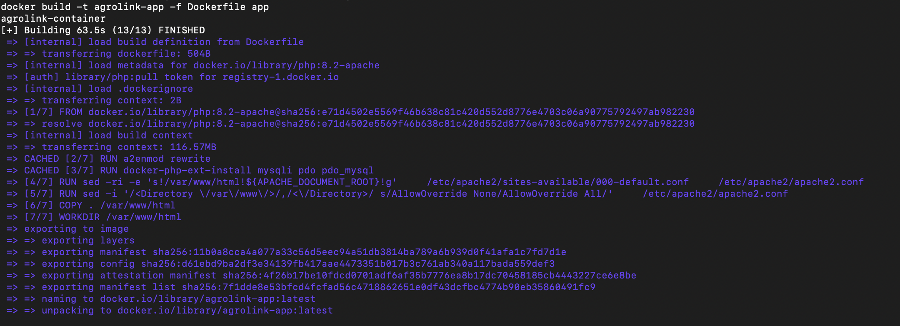
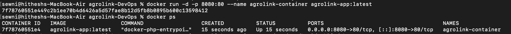
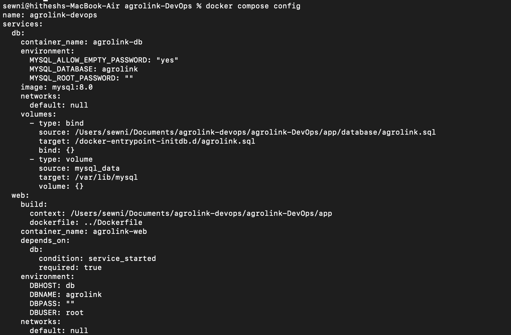
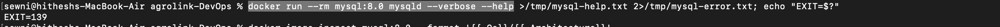
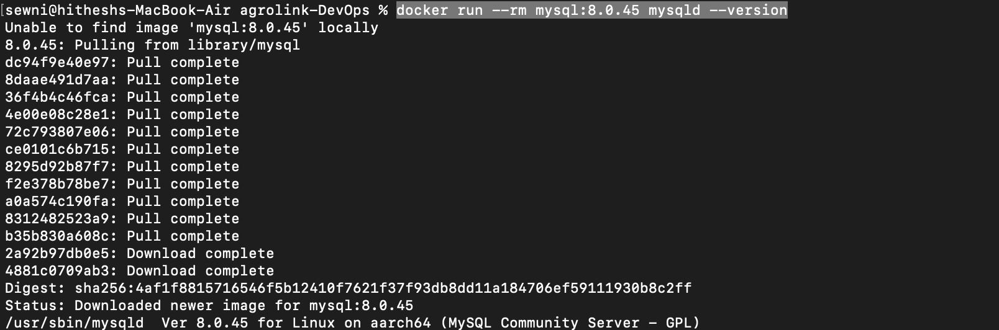
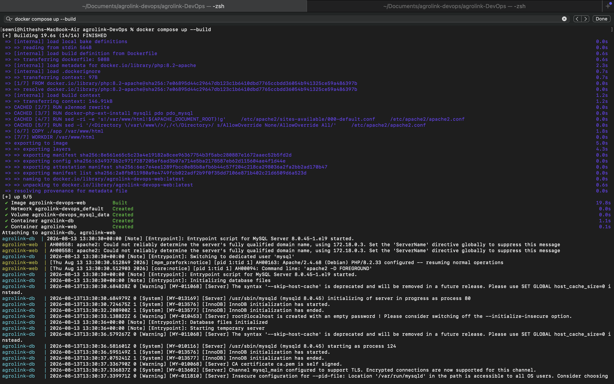
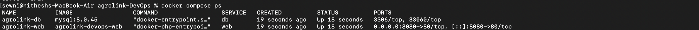
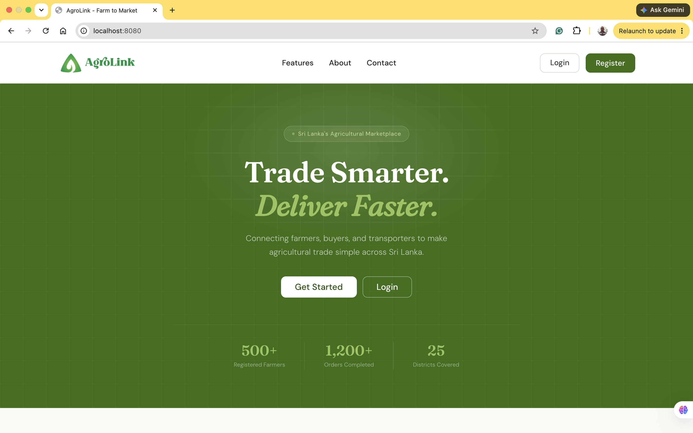
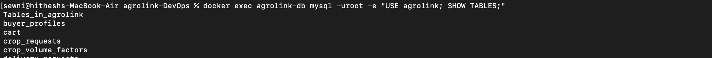

# 02. Containerization

## 1. Overview

Following the successful manual deployment of AgroLink to an AWS EC2 instance, the next stage was to containerize the application using Docker.

The objective of containerization was to create a reproducible environment in which the AgroLink application and its database could be started consistently without manually installing and configuring Apache, PHP, MySQL, and their dependencies on the host machine.

The containerized architecture consists of two primary services:

- **Web service** – PHP and Apache running the AgroLink application
- **Database service** – MySQL 8.0.45 containing the AgroLink database

Docker Compose is used to manage the services, networking, startup, and persistent database storage.

---

## 2. Objectives

The main objectives of the containerization stage were:

1. Create a Docker image for the AgroLink web application.
2. Containerize the PHP and Apache environment.
3. Run MySQL as a separate container.
4. Automatically initialize the AgroLink database.
5. Preserve database data using a Docker volume.
6. Allow the web container to communicate with MySQL through the Docker network.
7. Verify that the complete application works locally using Docker Compose.
8. Prepare the application for future containerized deployment to EC2.

---

## 3. Containerized Architecture

The final local architecture is:

                         Local Machine
                              │
                              │ localhost:8080
                              ▼
                    ┌───────────────────┐
                    │   agrolink-web    │
                    │   Apache + PHP    │
                    │   Container :80   │
                    └─────────┬─────────┘
                              │
                              │ db:3306
                              ▼
                    ┌───────────────────┐
                    │    agrolink-db    │
                    │   MySQL 8.0.45    │
                    │   Container :3306 │
                    └─────────┬─────────┘
                              │
                              ▼
                       ┌─────────────┐
                       │ mysql_data  │
                       │ Docker      │
                       │ Volume      │
                       └─────────────┘

                    Docker Compose Network

---

## 4. Technologies

The following technologies were used:

| Technology.    | Purpose                                                        |
|----------------|----------------------------------------------------------------|
| Docker         | Build and run isolated application containers                  |
| Docker Compose | Manage the web and database containers together                |
| Apache         | Web server inside the application container                    |
| PHP            | Backend runtime for AgroLink                                   |
| MySQL 8.0.45   | Database service                                               |
| Docker Volumes | Persist MySQL database data                                    |
| Docker Networking | Allow communication between the web and database containers |
| Git/GitHub     | Store and track project configuration and database fixes       |

---

## 5. Why the Dockerfile and `compose.yaml` Are Included

### Dockerfile

The **Dockerfile** defines how the AgroLink web image is built. It tells Docker what runtime environment the application needs, such as Apache, PHP, required PHP extensions, and the application files.

Its main purpose is to make the application environment reproducible instead of depending on PHP and Apache being manually installed on every machine.

### compose.yaml

The **Compose file** defines how the complete multi-container application runs. It connects the web and database services, maps ports, provides database environment variables, configures the MySQL volume, and mounts the SQL initialization file.

It is important because the project is not only one container. AgroLink requires both the web application and MySQL database to work together.

Therefore, these files are included in the repository because they act as the infrastructure definition for the containerized application.

---

## 6. Steps Taken

### Step 1 — Create the web container definition

A Dockerfile was created for the AgroLink application so Apache, PHP, required extensions, and the application could be packaged into a reusable image.






### Step 2 — Define the multi-container environment

A `compose.yaml` file was created with two services:

- `web`
- `db`

The web service was configured to connect to MySQL using:

```text
DBHOST=db
```

This works because Docker Compose provides an internal network where services can reach each other by service name.

### Step 3 — Configure database persistence

A named Docker volume was used for MySQL data:

```text
mysql_data
```

This allows the database container to be recreated without automatically deleting the stored database data.

### Step 4 — Configure database initialization

The AgroLink SQL dump was mounted into MySQL's initialization directory so the database could be created automatically during the first initialization of the MySQL container.

### Step 5 — Validate the Compose configuration

The configuration was checked using:

```bash
docker compose config
```




### Step 6 — Test the MySQL image

The initial `mysql:8.0` image failed in the local ARM64 Docker environment. A standalone MySQL test was used to determine whether the issue came from AgroLink or from the image itself.




```bash
docker run --rm mysql:8.0 mysqld --verbose --help
```

The tested version `mysql:8.0.45` worked successfully and was therefore used for the project.





### Step 7 — Check SQL compatibility

The AgroLink SQL dump had originally been generated from a MariaDB/phpMyAdmin environment. A MySQL compatibility issue was found and corrected before the final container initialization.

This also highlighted the importance of committing database fixes to Git rather than changing files only on a deployed server.

### Step 8 — Build and start the containers

The complete application was built and started using:

```bash
docker compose up --build
```




### Step 9 — Verify container status

The running containers were checked using:

```bash
docker compose ps
```

The expected services were:

```text
agrolink-web    Up
agrolink-db     Up
```




### Step 10 — Open the application

The application was opened through:

```text
http://localhost:8080
```




---

## 7. Troubleshooting

Only the main issues that affected the containerization process are included below.

### MySQL `8.0` image crash

The `mysql:8.0` image failed even when tested independently from Docker Compose and AgroLink.

**Resolution:** Use the known-working pinned image:

```text
mysql:8.0.45
```

### SQL dump compatibility issue

The SQL dump was created from a MariaDB environment and produced a MySQL syntax error related to a default expression.

**Resolution:** The SQL dump was corrected for MySQL compatibility and used for container initialization.

### Database already initialized

At one stage, importing the SQL dump again produced a `Table already exists` error.

**Cause:** The database had already been initialized in the persistent MySQL volume.

**Resolution:** Avoid re-importing the same SQL dump unnecessarily and understand that MySQL initialization scripts normally run only when the data directory is created for the first time.

### MySQL socket lock error

A later container restart produced a UNIX socket lock error.

**Resolution:** The container environment was recreated/restarted cleanly, after which MySQL started normally.

### Docker storage investigation

Docker storage was checked after a low-disk-space warning using commands such as:

```bash
docker system df
df -h /
```

This helped distinguish between Docker images, containers, volumes, and build cache usage.

---

## 8. Testing

The final setup was tested at several levels.

### Container status

```bash
docker compose ps
```

Both the web and database containers were confirmed to be running.

### MySQL startup

The database logs confirmed that MySQL 8.0.45 initialized successfully and became ready for connections.

### Database verification

The AgroLink tables were checked inside the MySQL container to confirm that the SQL dump had been loaded successfully.



### Application verification

The application was opened at:

```text
http://localhost:8080
```

The application loaded successfully and database-backed functionality worked, confirming communication between the PHP container and MySQL container.

---

## 9. Lessons Learned

- Docker allows the application runtime to be reproduced without manually installing the same dependencies on every machine.
- Docker Compose is useful for applications that depend on multiple services.
- Containers should communicate using service names such as `db`, not `localhost`.
- Database data should be stored in a persistent Docker volume.
- MySQL initialization scripts normally run only during first-time database initialization.
- Pinning a tested image version can make the environment more predictable.
- Infrastructure problems can be isolated by testing containers independently.
- Logs are important for distinguishing normal initialization messages from actual errors.
- Database and configuration fixes should be committed to Git so future deployments use the corrected version.

---

## 10. Skills Gained

This phase helped develop practical skills in:

- Docker fundamentals
- Writing and understanding Dockerfiles
- Docker Compose
- Multi-container application architecture
- Docker networking
- Docker volumes and data persistence
- Container logs and troubleshooting
- MySQL container initialization
- Database compatibility troubleshooting
- Docker image version management
- Testing containerized applications
- Version-controlling infrastructure configuration

---

## 11. Next Phase

The next phase is to deploy the already-containerized AgroLink application to AWS EC2.

That phase will focus on:

- Preparing the EC2 instance for Docker
- Cloning the project repository
- Running the Docker Compose stack on EC2
- Configuring required ports and security groups
- Verifying the containerized application in the cloud environment
- Preparing the project for a later CI/CD pipeline

The overall DevOps progression is therefore:

```text
Manual EC2 Deployment
        ↓
Containerization
        ↓
Containerized EC2 Deployment
        ↓
CI/CD
```
