# 03. Containerized Deployment

## 1. Overview

This phase focused on deploying the containerized AgroLink application to AWS EC2 using Docker and Docker Compose. The application was initially deployed alongside the existing native deployment for safe testing before transitioning to the Dockerized deployment.

## 2. Objectives

- Prepare the existing EC2 instance for Docker deployment.
- Deploy AgroLink using Docker Compose.
- Containerize the web application and MySQL database.
- Implement a MySQL health check and service dependency handling.
- Secure environment-specific database credentials using `.env`.
- Test the Dockerized application independently before replacing the native deployment.
- Diagnose and resolve EC2 resource limitations.
- Verify successful public access to the containerized application.

## 3. Architecture

### Existing EC2 Deployment

Before containerization, the EC2 instance hosted AgroLink directly:

```text
                         Internet
                            │
                            ▼
                    Elastic IP Address
                            │
                            ▼
                         AWS EC2
                            │
                         Port 80
                            │
                            ▼
                         Nginx
                            │
                            ▼
                       PHP 8.3-FPM
                            │
                            ▼
                         AgroLink
                            │
                            ▼
                    MySQL (localhost)
```

### Containerized Deployment

The Dockerized application uses Docker Compose to manage the web and database services:

```text
                         Internet
                            │
                            ▼
                    AWS EC2 Public IP
                            │
                          Port 80
                            │
                            ▼
                    Docker Compose
                       Network
                      ┌─────┴─────┐
                      │           │
                      ▼           ▼
               agrolink-web   agrolink-db
                PHP / Web      MySQL 8.0.45
                      │           │
                      └─────┬─────┘
                            │
                    Docker Network
```

> **Note:** The original native Nginx/PHP-FPM/MySQL services were used only during the migration and were later stopped and disabled after the Dockerized deployment was verified successfully.

### Migration Strategy

The migration followed a staged approach:

```text
Existing Native AgroLink
          │
          ▼
   Install Docker
          │
          ▼
Run Dockerized AgroLink
       on :8080
          │
          ▼
Verify Containers
and Database
          │
          ▼
Test Public Access
          │
          ▼
Stop Existing Native
Deployment
          │
          ▼
Move Dockerized Application
to Final :80 Configuration
```

This approach minimized risk by allowing the Dockerized application to be tested before replacing the existing working deployment.

## 4. Technologies

| Category | Technology |
|---|---|
| Cloud Platform | AWS |
| Compute | Amazon EC2 |
| Storage | Amazon EBS |
| Operating System | Ubuntu |
| Containerization | Docker |
| Container Orchestration | Docker Compose |
| Application Runtime | PHP |
| Web Server | Nginx / container web server |
| Database | MySQL 8.0.45 |
| Source Control | Git / GitHub |
| Environment Configuration | `.env` |
| Database Storage | Docker Named Volume |

## 5. Steps Taken

### Step 1 — Database Service Health Check

**Problem**

Docker Compose's basic `depends_on` only establishes container startup order. It does not guarantee that MySQL is ready to accept connections.

**Solution**

A health check was implemented for the MySQL database service using `mysqladmin ping` to verify MySQL availability. Docker Compose was configured with the `service_healthy` dependency condition so that the web service waits for the database to become healthy.

```text
MySQL Container Starts
        │
        ▼
   Health Check
        │
   ┌────┴────┐
   │         │
Unhealthy  Healthy
   │         │
 Wait        ▼
         Web Starts
```

**Result**

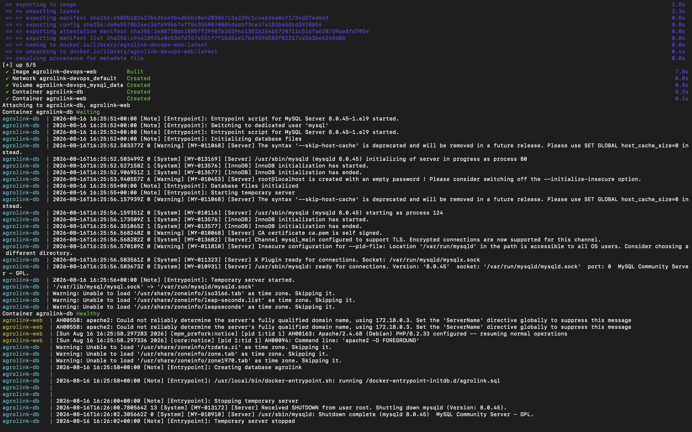

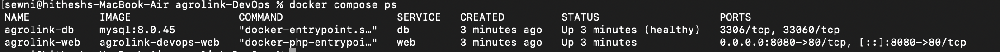

### Step 2 — EC2 Environment Assessment and Baseline

Before deploying the containerized application, the existing AWS EC2 environment was inspected to understand the current deployment, available resources, running services, storage, and network configuration.

The existing deployment was verified to be operational before making changes.

The existing native deployment continued running on port `80`, while the Dockerized application was planned to run on port `8080` for safe testing.

### Step 3 — Database Backup Before Migration

The existing MySQL database was backed up before introducing the containerized database environment.

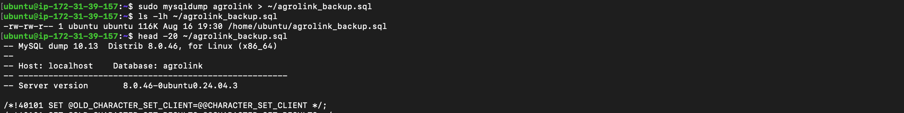

This provided a recovery point before making changes to the deployment environment.

### Step 4 — EC2 Preparation and Docker Installation

The EC2 instance was prepared for containerized deployment by updating the APT package index and configuring Docker's official Ubuntu package repository.

Docker Engine, Docker CLI, containerd, Buildx, and the Docker Compose plugin were installed.

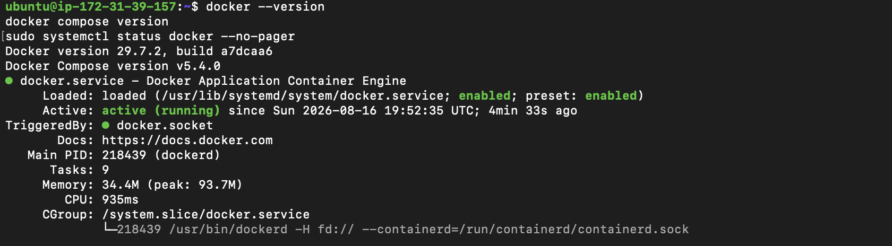

Docker permissions were also configured so the Ubuntu user could execute Docker commands without requiring `sudo`.

### Step 5 — Prepare the Dockerized Application for EC2

Before deployment, the Docker Compose configuration was reviewed for EC2 compatibility.

Environment-specific database credentials were separated from the Compose configuration using environment variables. The credentials were provided through an EC2-specific `.env` file and were not committed to the Git repository.

The `.env` file was excluded from version control using `.gitignore`.

The Dockerized application was configured to initially run on port `8080`, while the existing native deployment continued running on port `80`.

The updated Docker configuration was committed and pushed to GitHub. The repository was then cloned to EC2 and an EC2-specific `.env` file was created.

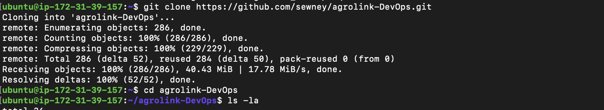

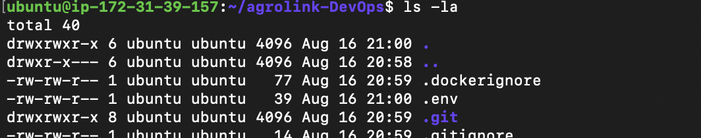

### Step 6 — Validate Docker Compose Configuration

The Docker Compose configuration was validated on EC2 before starting the containers:

```bash
docker compose config --quiet
docker compose config --services
```

The expected services were confirmed.

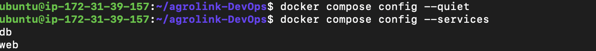

### Step 7 — Initial Docker Deployment and Disk-Space Failure

The application was initially started using:

```bash
docker compose up -d --build
```

The Docker web image was successfully built and the MySQL image was pulled. However, the database container remained in a waiting state and eventually failed.

The MySQL logs were inspected:

```bash
docker compose logs --tail=100 db
```

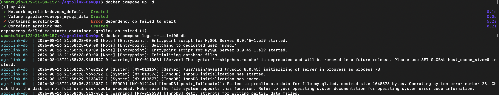

The logs revealed:

```text
Operating system error number 28
No space left on device
```

The EC2 instance had an 8 GiB root EBS volume with very limited available space. Docker and containerd storage, together with the existing application and database, consumed most of the available disk space.

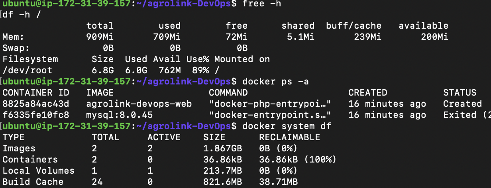

### Step 8 — Increase EC2 Storage

The root EBS volume was increased from **8 GiB to 20 GiB** in AWS.

After increasing the EBS volume, the root partition was expanded:

```bash
sudo growpart /dev/nvme0n1 1
```

The ext4 filesystem was then expanded:

```bash
sudo resize2fs /dev/root
```

The filesystem was verified using:

```bash
df -h /
```

The root filesystem increased to approximately 19 GiB of usable space, reducing disk usage to approximately 32%.

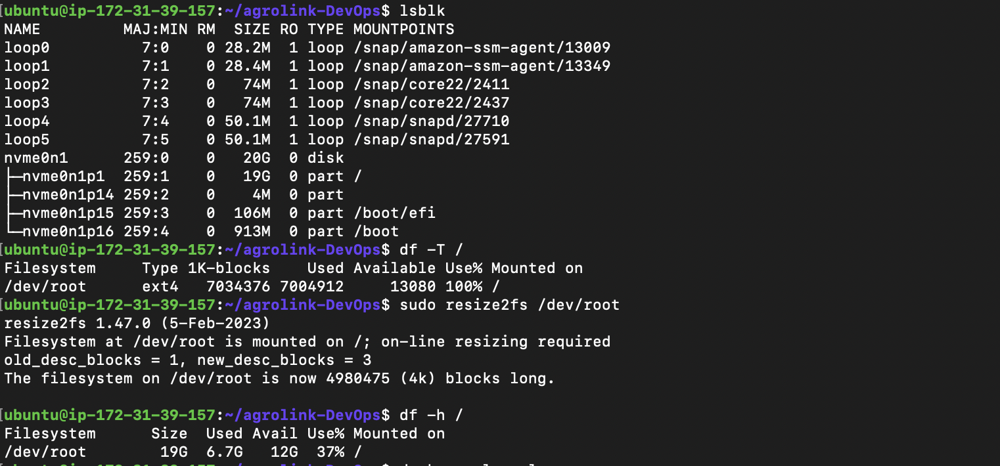

### Step 9 — Configure Swap Memory

Because the EC2 instance had limited RAM, a 1 GiB swap file was configured to provide additional virtual memory during resource-intensive Docker and MySQL operations.

The swap was enabled and configured to persist across reboots.

Verification was performed using:

```bash
free -h
```

The instance then had approximately 1 GiB of swap space available.

### Step 10 — Reinitialize the Docker Database

The failed MySQL initialization had left an incomplete Docker database volume.

The Docker-managed MySQL volume was removed and recreated so that MySQL could initialize cleanly after the storage issue was resolved.

The native MySQL database was not affected because the Docker database used a separate Docker named volume.

### Step 11 — Successful Docker Deployment

After resolving the storage limitation, the containerized application was started again without rebuilding the existing web image:

```bash
docker compose up -d
```

The deployment was verified using:

```bash
docker compose ps
```

Both services started successfully:

```text
agrolink-db    Up (healthy)
agrolink-web   Up
```

The MySQL health check passed successfully before the web service started.

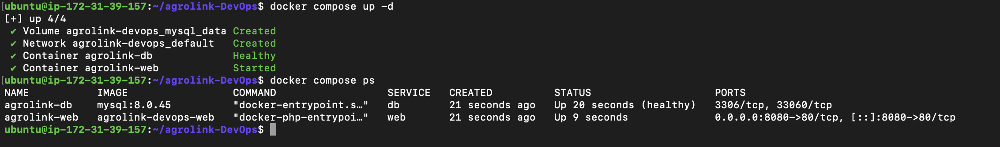

The web service was exposed through:

```text
0.0.0.0:8080 → container port 80
```

### Step 12 — Configure EC2 Security Group

Initially, the application was not accessible externally because the EC2 Security Group allowed inbound traffic on ports `22` and `80`, but not `8080`.

An inbound rule was added:

- **Type:** Custom TCP
- **Port:** `8080`
- **Source:** `0.0.0.0/0`

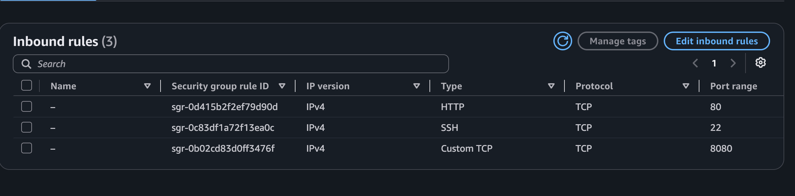

### Step 13 — Verify Public Access

The application was accessed through:

```text
http://<EC2-PUBLIC-IP>:8080
```

The AgroLink application loaded successfully in the browser, confirming successful public access to the containerized deployment.

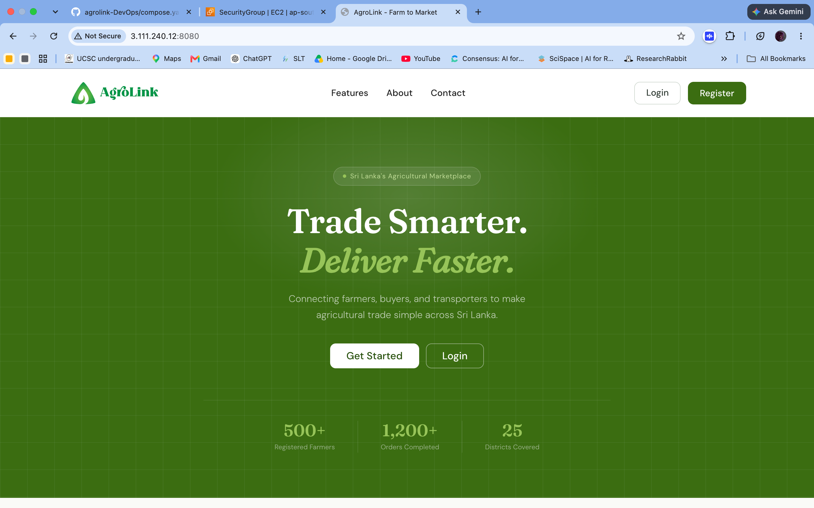

After the Dockerized application was verified successfully on port `8080`, the final migration was completed by moving the Docker web service to the standard HTTP port `80`.

### Step 14 — Change the Docker Port Mapping

The Compose web port mapping was changed from:

```yaml
ports:
  - "8080:80"
```

to:

```yaml
ports:
  - "80:80"
```

The updated `compose.yaml` was committed and pushed to GitHub, then pulled on the EC2 instance so the deployment configuration remained version-controlled.

The Docker stack was recreated and verified using:

```bash
docker compose down
docker compose up -d
docker compose ps
```

The web service was confirmed to be running on:

```text
0.0.0.0:80 → container port 80
```
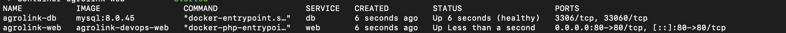

AgroLink was then tested successfully through the EC2 public IP without specifying port `8080`.

### Step 15 — Disable the Native Deployment

After confirming the Dockerized application was working correctly on port `80`, the old native services were stopped and disabled:

```bash
sudo systemctl stop nginx
sudo systemctl disable nginx

sudo systemctl stop php8.3-fpm
sudo systemctl disable php8.3-fpm

sudo systemctl stop mysql
sudo systemctl disable mysql
```

The native packages and files were not removed, which keeps them available temporarily as a rollback option.

The final EC2 state is:

```text
                         Internet
                            │
                            ▼
                    EC2 Security Group
                            │
                          Port 80
                            │
                            ▼
                    Dockerized AgroLink
                            │
                     Docker Network
                       ┌────┴────┐
                       │         │
                       ▼         ▼
                  Web Service  MySQL
                  Container   Container
```

The temporary Security Group rule for port `8080` is no longer required after the final port `80` deployment has been verified.

## 7. Skills and Learning Outcomes

Through this phase, the following practical skills were developed:

- Docker and Docker Compose deployment.
- Multi-container application architecture.
- Docker networking and service communication.
- Docker health checks and dependency management.
- Environment variable and `.env` management.
- Secure handling of environment-specific credentials.
- AWS EC2 deployment and configuration.
- EBS storage management.
- Linux partition and filesystem expansion.
- Linux swap configuration.
- Docker/containerd storage investigation.
- EC2 Security Group configuration.
- Troubleshooting container startup failures.
- Staged migration and deployment risk management.
- Verifying containerized applications in a real cloud environment.

A key practical lesson from this phase was that successful containerization requires consideration of the underlying host resources as well as the application configuration. The MySQL failure demonstrated the importance of monitoring disk space and diagnosing infrastructure-level issues during deployment.

## 8. Next Phase

With the manual Dockerized deployment now verified on port `80`, the next phase will focus on **CI/CD automation using GitHub Actions**.

The goal will be to automate application testing, Docker image building, and deployment to the EC2 environment instead of performing these steps manually.
